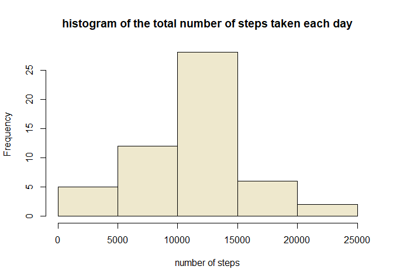
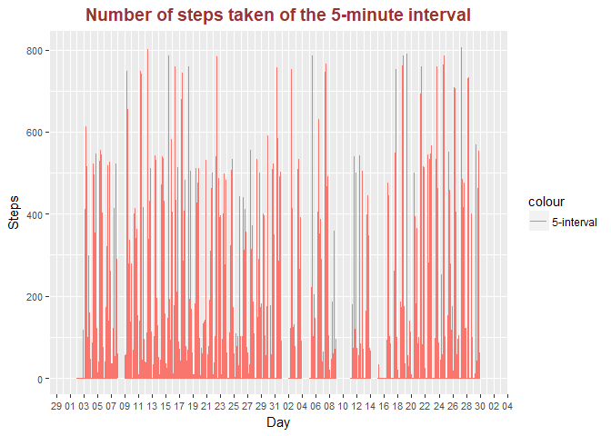
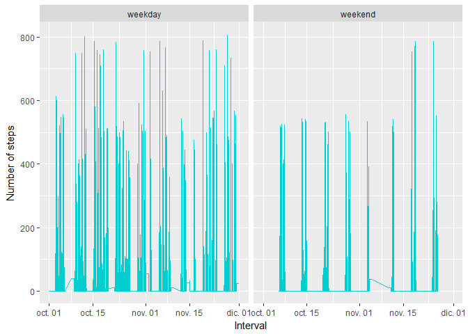

# Course Project 1
Griselda Barón Martínez  
10 de septiembre de 2017  


## Introduction

This assignment makes use of data from a personal activity monitoring device. This device collects data at 5 minute intervals through out the day. The data consists of two months of data from an anonymous individual collected during the months of October and November, 2012 and include the number of steps taken in 5 minute intervals each day.

# Loading and preprocessing the data

```r
library(dplyr)
```

```
## 
## Attaching package: 'dplyr'
```

```
## The following objects are masked from 'package:stats':
## 
##     filter, lag
```

```
## The following objects are masked from 'package:base':
## 
##     intersect, setdiff, setequal, union
```

```r
library(lubridate)
```

```
## 
## Attaching package: 'lubridate'
```

```
## The following object is masked from 'package:base':
## 
##     date
```

```r
library(ggplot2)
library(scales)

activity <- read.csv("activity.csv", header=T,sep=",")

temp <- mapply(function(x, y) paste0(rep(x, y),
	collapse = ""), 0, 4 - nchar(activity$interval))

activity <- activity %>% mutate(datetime=paste0(activity$date,temp,
	activity$interval)) %>%
	mutate(datetime=ymd_hm(datetime)) %>%
	select(datetime,steps)  
head(activity)
```

```
##              datetime steps
## 1 2012-10-01 00:00:00    NA
## 2 2012-10-01 00:05:00    NA
## 3 2012-10-01 00:10:00    NA
## 4 2012-10-01 00:15:00    NA
## 5 2012-10-01 00:20:00    NA
## 6 2012-10-01 00:25:00    NA
```

## What is mean total number of steps taken per day?

Calculate the total number of steps taken per day


```r
act_by.day <- activity %>% mutate (date=floor_date(datetime, "1 day"))%>%
	group_by(date) %>%
	summarize(total.steps=sum(steps))

act_by.day <- data.frame(act_by.day)

hist(act_by.day$total.steps,col="cornsilk2",xlab="number of steps",
	main="histogram of the total number of steps taken each day")
```

<!-- -->

Report the mean and median of the total number of steps taken per day


```r
mean(act_by.day$total.steps,na.rm = TRUE)
```

```
## [1] 10766.19
```

```r
median(act_by.day$total.steps,na.rm = TRUE)
```

```
## [1] 10765
```

## What is the average daily activity pattern?


```r
graf <- ggplot(activity)
graf+geom_line(aes(datetime,steps,color="5-interval"))+
    scale_x_datetime(limits = c(activity$datetime[1],
	activity$datetime[nrow(activity)]), 
    breaks = date_breaks("2 day"), labels = date_format("%d")) +
    ylab("Steps") + xlab("Day")+
    ggtitle("Number of steps taken of the 5-minute interval")+
    theme(axis.text.x=element_text(size=8),
        axis.text.y=element_text(size=8),
	plot.title = element_text(color = "#993333", size=14, 
	face="bold", hjust=0.5))
```

```
## Warning: Removed 576 rows containing missing values (geom_path).
```

<!-- -->

Which 5-minute interval, on average across all the days in the dataset, contains the maximum number of steps?


```r
activity[which.max(activity$steps),]
```

```
##                  datetime steps
## 16492 2012-11-27 06:15:00   806
```

## Imputing missing values

Calculate and report the total number of missing values in the dataset (i.e. the total number of rows with NAs)


```r
missing.values <- which(is.na(activity$steps))
length(missing.values) #total number of rows with NAs
```

```
## [1] 2304
```

 Strategy for filling in all of the missing values in the dataset


```r
act_by.day <- activity %>% mutate (date=floor_date(datetime, "1 day"))%>%
	group_by(date) %>%
	summarize(total.steps=sum(steps),
	mean.steps = mean(steps,na.rm=TRUE))
act_by.day <- data.frame(act_by.day)

activity.filled <- activity
dates.miss <- unique(date(activity.filled$datetime[missing.values]))

ind<- which(act_by.day$date == dates.miss[1])
	ind.miss <- which(date(activity.filled$datetime)== act_by.day$date[ind])
	activity.filled$steps[ind.miss] <- act_by.day$mean.steps[
		mean((ind+1),(ind+2),na.rm=T)]

for(i in 2:length(dates.miss)){
	ind<- which(act_by.day$date == dates.miss[i])
	ind.miss <- which(date(activity.filled$datetime)== act_by.day$date[ind])
	activity.filled$steps[ind.miss] <- act_by.day$mean.steps[
		mean((ind-1),(ind+1),na.rm=T)]
}

missing.values <- which(is.na(activity.filled$steps))
dates.miss <- unique(date(activity.filled$datetime[missing.values]))

ind<- which(act_by.day$date == dates.miss[1])
	ind.miss <- which(date(activity.filled$datetime)== act_by.day$date[ind])
	activity.filled$steps[ind.miss] <- act_by.day$mean.steps[
		mean((ind-2),(ind-1),(ind+1),(ind+2),na.rm=T)]
```

Histogram of the total number of steps taken each day after missing values are imputed


```r
filled_by.day <- activity.filled %>% 
	mutate (date=floor_date(datetime, "1 day"))%>%
	group_by(date) %>%
	summarize(total.steps=sum(steps))
filled_by.day <- data.frame(filled_by.day)

hist(filled_by.day$total.steps,col="cornsilk2",xlab="number of steps",
	main="histogram of the total number of steps taken each day")
```

<!-- -->

Calculate and report the mean and median total number of steps taken per day. Do these values differ from the estimates from the first part of the assignment? What is the impact of imputing missing data on the estimates of the total daily number of steps? 

You can see that the distribution of the data has changed (the median has changed) 


```r
mean(filled_by.day$total.steps,na.rm = TRUE)
```

```
## [1] 10304.18
```

```r
median(filled_by.day$total.steps,na.rm = TRUE)
```

```
## [1] 10571
```


## Are there differences in activity patterns between weekdays and weekends?

Create a new factor variable in the dataset with two levels – “weekday” and “weekend” indicating whether a given date is a weekday or weekend day.


```r
activity.filled <- activity.filled %>%
	mutate(wday = ifelse(weekdays(activity$date) %in% 
 	c("sábado","domingo"), "weekend", "weekday"))


p <- ggplot(activity.filled,aes(x=datetime,y=steps))
p + geom_line(color="cyan3") +  facet_wrap( ~ wday, ncol=2) +
        labs(x = "Interval",y="Number of steps")
```

<!-- -->


